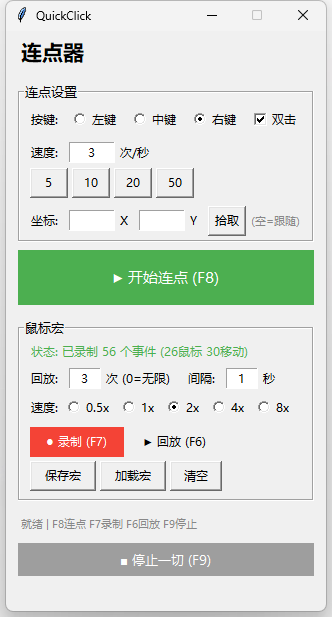

<h1 align="center">⚡ QuickClick</h1>

<p align="center"><b>一款 Windows 平台的轻量工具，集「高速鼠标连点器」与「宏录制/回放」于一体，支持全局热键控制，游戏、办公、自动化场景通用。</b></p>

<p align="center">
  
  
  
  
</p>

<p align="center">
  <a href="#功能亮点">功能亮点</a> •
  <a href="#界面预览">界面预览</a> •
  <a href="#快速开始">快速开始</a> •
  <a href="#快捷键">快捷键</a> •
  <a href="#更新日志">更新日志</a> •
  <a href="#english">English</a>
</p>

---

## 功能亮点

- **🖱️ 高速连点** — 最高 200 CPS（5ms 间隔），支持左键 / 中键 / 右键 / 双击切换
- **📌 锚定坐标** — 指定屏幕坐标固定位置连点，支持一键拾取鼠标当前位置
- **🎬 宏录制** — 录制鼠标点击 + 移动轨迹 + 键盘操作，支持无限循环回放
- **⚡ 回放控制** — 支持速度调整（0.5x ~ 8x）、剩余次数显示、循环次数设置
- **⌨️ 全局热键** — 任何界面下都能用快捷键启停，无需切换窗口
- **📦 轻量无依赖** — 纯 Python 实现，可直接运行或打包为单文件 EXE

## 界面预览

<p align="center">
  
</p>

程序启动后显示简洁的单面板 GUI，分为「连点器」和「宏录制」两个独立区域：
- **连点器区域**：按键选择（左键/中键/右键/双击）、速度调节、坐标锚定
- **宏录制区域**：录制/回放/保存/加载、速度选择（0.5x~8x）、回放次数设置
- **状态栏**：实时显示当前状态和剩余回放次数

## 快速开始

### 方式一：下载 EXE（推荐）

前往 [Releases](https://github.com/qiuyuehu/QuickClick/releases) 页面，下载最新版本的 `QuickClick.exe`，双击直接运行，无需安装 Python。

### 方式二：命令行运行

```bash
# 1. 克隆仓库
git clone https://github.com/qiuyuehu/QuickClick.git
cd QuickClick

# 2. 安装依赖
pip install pynput

# 3. 启动
python main.py
```

### 方式三：自行打包 EXE

```bash
# 1. 克隆仓库
git clone https://github.com/qiuyuehu/QuickClick.git
cd QuickClick

# 2. 安装依赖
pip install pynput pyinstaller

# 3. 打包
pyinstaller --onefile --windowed --name QuickClick main.py
```

> **注意**：部分杀毒软件可能对 Python 打包的 EXE 误报，代码完全开源，可自行审计后添加信任。

## 快捷键

| 快捷键 | 功能 | 备注 |
|--------|------|------|
| `F8` | 开始 / 停止连点 | 切换连点启停状态 |
| `F7` | 开始 / 停止录制宏 | 录制期间记录鼠标点击、移动轨迹、键盘操作 |
| `F6` | 回放宏 | 支持速度调整和循环，按 `F9` 随时中断 |
| `F9` | 紧急停止 | 一键终止所有正在运行的任务 |

> 若热键与其他软件冲突，可直接编辑 `gui.py` 中的 `HOTKEY_*` 常量修改，无需改动核心逻辑。

## 配置说明

| 参数 | 位置 | 说明 |
|------|------|------|
| 热键绑定 | `gui.py` → `HOTKEY_*` 常量 | 修改为 `pynput` 支持的任意按键 |
| CPS 上限 | `gui.py` → 连点速度输入框 | 最小间隔 5ms（200 CPS） |
| 锚定坐标 | `gui.py` → 坐标输入框 / 拾取按钮 | 留空 = 跟随鼠标 |
| 移动轨迹采样 | `core.py` → `_on_move` 方法 | 当前 150ms，可根据需要调整 |
| 宏文件格式 | `core.py` → `MacroRecorder` | JSON 格式，支持鼠标+键盘事件 |

## 项目结构

```
QuickClick/
├── main.py       # 程序入口
├── core.py       # 连点器 + 宏录制核心引擎
├── gui.py        # GUI 界面 + 热键管理
├── start.bat     # Windows 一键启动脚本
├── LICENSE       # MIT 开源协议
└── README.md     # 项目文档
```

## 系统要求

- **操作系统**：Windows 10 / 11
- **Python**：3.7 及以上（打包后不需要）
- **依赖**：[pynput](https://pypi.org/project/pynput/)

## 常见问题

**Q：杀毒软件报毒怎么办？**
A：这是 Python 打包的常见误报。代码完全开源，可自行审计后添加白名单。

**Q：热键和其他软件冲突了？**
A：编辑 `gui.py` 中的 `HOTKEY_TOGGLE_CLICK`、`HOTKEY_TOGGLE_RECORD`、`HOTKEY_REPLAY`、`HOTKEY_STOP` 常量，改为 `pynput` 支持的任意按键即可。

**Q：连点速度上限是多少？**
A：理论上限 200 CPS（5ms 间隔），实际取决于系统负载。

**Q：宏录制支持键盘操作吗？**
A：v1.1 起支持。录制期间所有鼠标点击、移动轨迹和键盘操作都会被记录，热键（F6-F9）会自动过滤。

**Q：回放速度可以调整吗？**
A：v1.2 起支持。在宏录制区域选择速度倍率（0.5x/1x/2x/4x/8x），回放时会自动应用。

## 更新日志

### v1.2.0（2026-05-27）

- ✨ 连点器新增双击功能（勾选"双击"复选框）
- ✨ 宏录制新增鼠标移动轨迹记录（150ms 采样，延迟为0，不干扰点击事件时机）
- ✨ 宏回放新增速度调整（0.5x/1x/2x/4x/8x 倍速选择）
- ✨ 宏回放状态实时显示剩余次数（第 X 轮，剩余 Y 次）
- 🎨 状态栏显示优化：区分鼠标/移动/键盘事件数量
- 📐 窗口尺寸调整（320x580）

### v1.1.0（2026-05-26）

- ✨ 宏录制新增键盘操作记录（自动过滤热键 F6-F9）
- ✨ 连点器新增鼠标中键支持
- ✨ 新增锚定坐标固定位置连点（支持一键拾取坐标）
- ✨ 宏状态显示区分鼠标/键盘事件数量
- ✨ 宏文件格式兼容升级（向后兼容 v1.0 格式）

### v1.0.0（2026-05-23）

- 🎉 初始发布
- ✨ 连点器功能（左键/右键，可调速度）
- ✨ 鼠标宏录制与无限循环回放
- ✨ 全局热键控制（F6-F9）
- ✨ 支持打包为独立 EXE

## 作者

**qiuyuehu** — [GitHub](https://github.com/qiuyuehu)

**衾衾 (Hermes Agent)** — 开发与设计

## License

[MIT](LICENSE)

---

<p align="center">
  如果觉得有用，点个 ⭐ Star 支持一下吧！
</p>

---

<a name="english"></a>

# English Version

## QuickClick

A lightweight Windows tool that combines a high-speed mouse auto-clicker with macro recording/playback. Supports global hotkeys, perfect for gaming, office work, and automation tasks.

### Features

- **🖱️ High-Speed Clicking** — Up to 200 CPS (5ms interval), supports left/middle/right button + double-click
- **📌 Anchor Coordinates** — Click at fixed screen coordinates, with one-click position capture
- **🎬 Macro Recording** — Record mouse clicks, movement轨迹, and keyboard input with infinite loop playback
- **⚡ Playback Control** — Speed adjustment (0.5x ~ 8x), remaining count display, loop count settings
- **⌨️ Global Hotkeys** — Control from any application without switching windows
- **📦 Lightweight** — Pure Python, runs directly or packages into a single EXE

### Quick Start

1. Download `QuickClick.exe` from [Releases](https://github.com/qiuyuehu/QuickClick/releases)
2. Double-click to run (no Python installation required)

Or run from source:
```bash
git clone https://github.com/qiuyuehu/QuickClick.git
cd QuickClick
pip install pynput
python main.py
```

### Hotkeys

| Key | Function | Notes |
|-----|----------|-------|
| `F8` | Start/Stop clicking | Toggle auto-clicker |
| `F7` | Start/Stop recording | Records mouse clicks, movement, and keyboard |
| `F6` | Play macro | Supports speed adjustment, press `F9` to stop |
| `F9` | Emergency stop | Stops all running tasks |

### Changelog

#### v1.2.0 (2026-05-27)
- Double-click support for auto-clicker
- Mouse movement轨迹 recording (150ms sampling)
- Playback speed adjustment (0.5x/1x/2x/4x/8x)
- Real-time remaining playback count display
- Status bar shows mouse/movement/keyboard event counts

#### v1.1.0 (2026-05-26)
- Keyboard operation recording
- Mouse middle button support
- Anchor coordinate clicking
- Macro status display improvements

#### v1.0.0 (2026-05-23)
- Initial release
- Auto-clicker with adjustable speed
- Mouse macro recording and playback
- Global hotkey control (F6-F9)

---

<p align="center">
  Made with ❤️ by <a href="https://github.com/qiuyuehu">qiuyuehu</a>
</p>